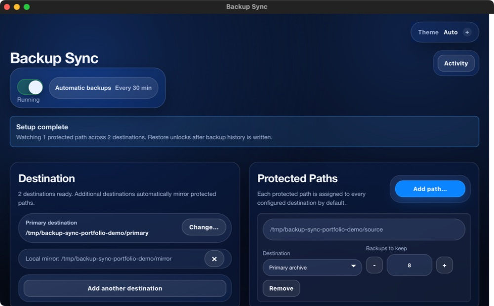
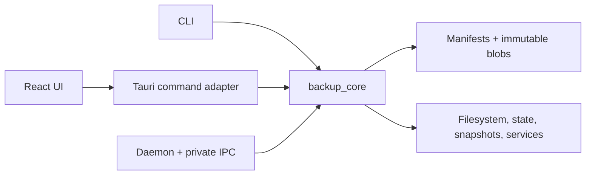
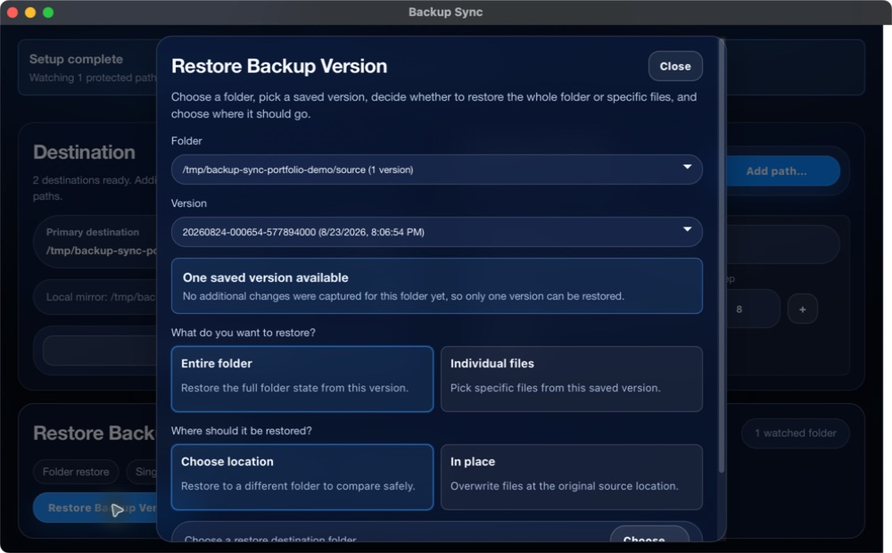

# Backup Sync

<p align="center">
  <a href="https://github.com/hydroLB/backup-sync/actions/workflows/ci.yml"></a>
  <a href="https://github.com/hydroLB/backup-sync/actions/workflows/codeql.yml"></a>
  <a href="LICENSE"></a>
  
  
</p>

<p align="center">
  
</p>

<p align="center">
  <strong>Local-first, versioned backups engineered around the restore path.</strong>
</p>

<p align="center">
  <a href="https://backup-sync-web-edition.young-hen-7947.chatgpt.site"><strong>Launch the interactive web edition</strong></a>
</p>

Backup Sync protects folders on external drives and mounted destinations through a Rust engine, background daemon, CLI, and Tauri/React desktop app. Its content-addressed store keeps unchanged bytes once; its safety model treats metadata, concurrency, corruption, and partial failure as first-class design problems.

> [!IMPORTANT]
> Backup Sync is pre-1.0 and source-distributed. This repository does not yet publish packaged, signed, or notarized installers. See the [roadmap](docs/roadmap.md) for the remaining release work.

The web edition uses the desktop app's exact React interface with a browser-local storage engine behind the existing controls. It performs real SHA-256 hashing, content deduplication, versioning, verification, replication repair, and restore on browser-owned data without uploading files. Native background services, unrestricted filesystem access, and OS snapshots remain exclusive to the full desktop application. See the [web edition contract](docs/web-edition.md).

## Why it is technically interesting

| Problem | Implemented control |
|---|---|
| A file changes while being read | The final plaintext SHA-256 must match the blob key; mismatched source reads never publish under the wrong hash. |
| Store metadata is hostile or corrupt | Version IDs, manifest keys, relative paths, and 64-character lowercase hashes are validated before use. |
| Restore fails halfway | Blobs and free space are preflighted, decoded bytes are re-hashed, selected files are staged before mutation, and targets are replaced atomically without following symlink components. |
| Two processes mutate one store | Backup, restore, scrub, retention, and replication take bounded per-store cross-process leases in deterministic order. |
| A replica is incomplete | Replication repairs missing manifests and blobs, then publishes the destination index only after revalidation. |
| Integrity work must stay bounded | Sampled scrub uses a coprime stride with guaranteed termination; periodic full scrub covers every referenced blob. |
| A process dies during state save | State is flushed and fsynced to a same-directory temporary file before atomic replacement. |
| A second daemon starts | A private per-user IPC endpoint identifies a live singleton and refuses to unlink an endpoint it does not own. |

The production path is the versioned engine in `crates/core/src/backup/versioned`. The original scan-plan-copy engine remains only as an explicit legacy compatibility surface.

## Architecture



`backup_core` owns the domain rules and local storage infrastructure. The daemon, CLI, and GUI orchestrate those APIs; the frontend talks only through typed Tauri commands. Automated boundary checks prevent reverse dependencies. Read the [architecture narrative](docs/architecture.md), [module contract](docs/module-boundaries.md), and [ADRs](docs/adr/README.md).

### Source map

| Path | Responsibility |
|---|---|
| `crates/core` | Config, scanning, versioned storage, restore, retention, scrub, replication, state, and platform adapters |
| `crates/daemon` | Scheduling, watcher coordination, singleton IPC, service lifecycle, and graceful shutdown |
| `crates/cli` | Setup, status, backup execution/simulation, verification, service control, and diagnostics |
| `crates/gui` | Tauri commands, tray behavior, desktop lifecycle, and native dialogs |
| `crates/gui/frontend` | Shared React presentation, request state, error boundaries, typed IPC service wrappers, and the isolated browser runtime |
| `docs` | Storage/security contracts, decisions, runbooks, risks, and release policy |

## Storage and recovery model

1. The engine scans an enabled source and builds a candidate manifest.
2. New plaintext content is encoded once under `.backup_sync/v1/blobs/sha256/<prefix>/<hash>`.
3. Blob bytes are persisted and verified before the immutable version manifest is committed.
4. The source index is updated last; retention removes old manifests before garbage collection.
5. Replication validates the source, repairs destination content, and publishes its index last.
6. Restore validates metadata and decoded content before replacing the requested target.

Optional zstd compression and chunked XChaCha20-Poly1305 encryption affect blob bytes, not manifest paths or metadata. Losing the encryption key makes encrypted blobs unrecoverable. See the [storage contract](docs/storage.md) and [threat model](docs/threat-model.md).

<p align="center">
  
</p>

## Quick start (macOS and Linux)

Prerequisites: Rust 1.93.0 from `rust-toolchain.toml`, Node 22.22.0 from `.nvmrc`, npm, Python 3, and the [native prerequisites for Tauri 2](https://v2.tauri.app/start/prerequisites/).

```bash
git clone https://github.com/hydroLB/backup-sync.git
cd backup-sync
make frontend-install
./start
```

`./start` installs locked frontend dependencies, builds and starts the daemon when configuration is available, then launches the desktop development app. Tauri and Vite use fixed port `5173`; custom `BACKUP_SYNC_DEV_PORT` or `VITE_PORT` values are rejected when they disagree.

Windows is compile-checked in CI, but its native launcher, named-pipe behavior, service integration, and clean-machine runtime are not yet validated. Windows users should treat the repository as buildable source—not a supported first-run path—until that roadmap item closes.

For a non-interactive build:

```bash
make build
```

The build produces debug Rust binaries under `target/debug` and the frontend bundle under `crates/gui/frontend/dist`; it does not create an installer. See [Getting started](docs/getting-started.md) for platform prerequisites and first-run steps.

## CLI essentials

```bash
cargo run -p cli -- init
cargo run -p cli -- status
cargo run -p cli -- run-once --dry-run
cargo run -p cli -- run-once
cargo run -p cli -- verify
cargo run -p cli -- doctor
cargo run -p cli -- install-service --enable
```

Use `keygen` before enabling encryption. A dry run is the safest way to review a new source/destination mapping.

## Configuration and local files

Backup Sync uses the operating system's native config directory:

| Platform | Config and state directory |
|---|---|
| macOS | `~/Library/Application Support/backup_sync/` |
| Linux | `${XDG_CONFIG_HOME:-~/.config}/backup_sync/` |
| Windows | `%APPDATA%\backup_sync\` |

`config.toml`, `state.json`, and the default encryption key live in that directory. Logs and the default backup root use the OS-native data directory. `BACKUP_SYNC_CONFIG` selects an explicit config file for both reads and writes; the file must already exist when selected. `BACKUP_SYNC_INTERVAL_SECONDS` and `BACKUP_SYNC_SAFE_MODE` provide validated runtime overrides.

The desktop UI keeps the common schedule at 30 minutes and normalizes that value when it saves. Advanced scheduling, replication, compression, encryption, scrub, and snapshot settings remain file-driven. See the complete [configuration reference](docs/configuration.md).

## Desktop lifecycle

- Closing the window hides it; it does not trigger a backup or mutate configuration.
- Quitting the GUI closes only the GUI. An installed background service continues running.
- The Running toggle maps to safe mode and pauses or resumes background writes.
- Restore searches are explicit and stale requests cannot replace newer folder/version selections.

## Quality gates

`make check` is the canonical local and CI contract. It runs Rust/frontend formatting and linting, Rustdoc, architecture and operability policies, TypeScript checks, repository/docs hygiene, desktop-tool tests, lockfile checks, performance guards, backend tests, builds, Rust/frontend coverage, secret scans, dependency policy, and vulnerability audits. `make ci` is an alias.

Useful focused commands:

```bash
make test
make frontend-test
make coverage
make perf-check
make security-check
make docs-check
```

The current local coverage measurement is **63.23% Rust lines, 60.70% functions, and 62.97% regions**. The frontend suite currently reports **67 tests**. These are measurements, not claims of exhaustive coverage; enforced thresholds are defined by the build scripts.

Hosted CI runs Linux quality gates plus macOS and Windows workspace compilation. Those jobs prove conditional compilation, not packaging, native service runtime behavior, or clean-machine recovery.

Dependency policy currently reports zero known vulnerabilities. `cargo deny` also surfaces 19 informational warnings from the transitive Tauri/Linux GTK3 and HTML stack; they are warnings, not an advisory ignore list. Their status and other residual risks are tracked in the [risk register](docs/risk-register.md).

## Troubleshooting

- Invalid config: launch the shell, fix the path/value shown, then use Retry; `cargo run -p cli -- doctor` provides a redacted diagnostic report.
- Daemon unavailable: check `cargo run -p cli -- status` and the [stuck daemon runbook](docs/runbooks/stuck-daemon.md).
- Destination offline: keep safe mode enabled until the drive is mounted and writable; follow the [destination runbook](docs/runbooks/destination-offline.md).
- Verify failure: do not delete evidence or overwrite the affected store; follow the [verification](docs/runbooks/verify-failure.md) and [corruption](docs/runbooks/corruption-suspicion.md) runbooks.
- Port 5173 busy: stop the conflicting process. The development port is intentionally fixed.

## Tradeoffs and open work

- Manifests remain plaintext for inspectable recovery and stable deduplication; file paths and metadata are not confidential.
- The state file is atomically replaced, but cross-process read-modify-write updates are not transactional.
- Blocking filesystem tasks leave the async runtime, but in-flight `spawn_blocking` work is not cooperatively cancellable.
- Windows named-pipe ACLs and platform runtime behavior still need clean-machine verification.
- Packaged and signed artifacts, native installers, and full platform recovery tests are not available yet.
- The legacy engine remains until consumers migrate under the documented deprecation policy.

See the [roadmap](docs/roadmap.md), [risk register](docs/risk-register.md), and [release process](docs/release.md) for the honest pre-1.0 boundary.

## Documentation

| Topic | Start here |
|---|---|
| Setup and configuration | [Getting started](docs/getting-started.md), [configuration](docs/configuration.md) |
| Design | [Architecture](docs/architecture.md), [storage](docs/storage.md), [ADRs](docs/adr/README.md) |
| Interactive showcase | [Web edition](docs/web-edition.md) |
| Operations | [Operability](docs/operability.md), [runbooks](docs/runbooks/README.md), [performance](docs/performance-tuning.md) |
| Security and delivery | [Security policy](SECURITY.md), [threat model](docs/threat-model.md), [branch protection](docs/branch-protection.md) |
| Project status | [Changelog](CHANGELOG.md), [roadmap](docs/roadmap.md), [risk register](docs/risk-register.md) |

## Contributing and license

Read [CONTRIBUTING.md](CONTRIBUTING.md) before opening a change. Backup Sync is available under the [MIT License](LICENSE).
