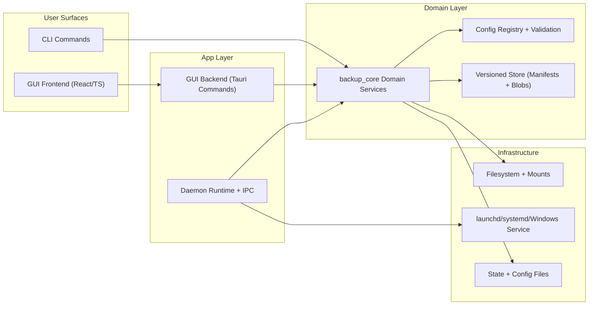

# Architecture

Last updated: 2026-02-20

Backup Sync is a local-first desktop backup system optimized for correctness and operability over novelty. The architecture keeps business rules in one place (`backup_core`), keeps IO at the edges (daemon/CLI/GUI adapters), and favors deterministic behavior so local and CI outcomes match.

## System at a glance
- Domain engine: `crates/core` owns backup, restore, retention, validation, and integrity logic.
- Runtime orchestration: `crates/daemon` runs schedules, IPC, and lifecycle management.
- Operator interfaces: `crates/cli` and `crates/gui` call domain services through explicit boundaries.
- Presentation: `crates/gui/frontend` is a TypeScript React UI that talks only to Tauri command contracts.

## Architectural view

Dependency rule: `core` has no dependency on `daemon`, `cli`, `gui`, or `frontend`. Every external interface points inward to `core`.

## Critical flows
1. Backup cycle
   - Daemon loads validated config, plans changes, writes versioned manifests/blobs, applies retention, emits structured logs.
2. Verify and scrub
   - Integrity routines in `core` re-hash and cross-check blob references; failures are surfaced as structured boundary errors.
3. Restore
   - CLI/GUI select version and destination mode, then call domain restore pipelines with preflight checks and bounded IO.
4. Health/readiness
   - Daemon exposes IPC health/readiness probes and participates in graceful shutdown with bounded join timeouts.

## Data model and consistency model
- Storage format: content-addressed blobs by SHA-256 plus per-version manifests (`docs/storage.md`).
- Consistency guardrails:
  - New version is emitted only when snapshot delta is non-empty.
  - Retention prunes manifests first, then GC removes unreferenced blobs.
  - Validation fails fast on config violations before runtime work starts.
  - Verify paths provide explicit integrity status before destructive recovery actions.

## Why this design is defensible
- Boring and auditable stack: Rust + TypeScript, Cargo/npm lockfiles, Makefile command contract.
- Strong boundaries: domain logic is centralized; adapters stay thin and replaceable.
- Operable by default: typed errors, structured logs, runbooks, health/readiness, graceful shutdown.
- Incremental evolution path: major decisions are documented as ADRs and linked to concrete code ownership.

## Decision records and principles
- ADR index: [`docs/adr/README.md`](adr/README.md)
- Design principles: [`docs/design-principles.md`](design-principles.md)
- Module boundaries contract: [`docs/module-boundaries.md`](module-boundaries.md)
- Public API ownership: [`docs/public-api.md`](public-api.md)
