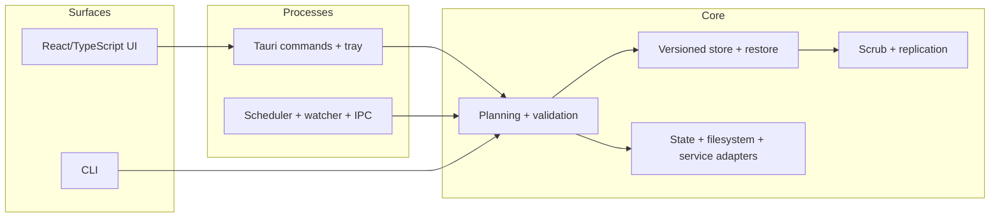

# Architecture

Last updated: 2026-08-23

Backup Sync is a local-first backup system whose dependency structure follows its safety model: one core crate owns backup rules and local storage infrastructure, while process and presentation layers orchestrate it.

## System view

The `backup_core` crate does not depend on daemon, CLI, GUI, or frontend code. Core is not a pure domain model: it intentionally owns filesystem-backed stores, atomic state persistence, platform paths, snapshot providers, and service-manifest generation because those mechanisms enforce domain invariants.

## Package responsibilities

| Package | Owns |
|---|---|
| `crates/core` | Config validation, scan/planning, immutable blobs, manifests/indexes, restore, retention/GC, scrub, replication, state, filesystem and platform adapters |
| `crates/daemon` | Runtime scheduling, enabled-path watchers, singleton IPC, async/blocking boundaries, state-commit coordination, shutdown |
| `crates/cli` | Operator workflows and exit semantics over core APIs |
| `crates/gui` | Tauri commands, native dialogs, tray and window lifecycle, service actions |
| `crates/gui/frontend` | Presentation state, explicit request sequencing, accessibility, and typed command wrappers |

Automated enforcement lives in `scripts/check-boundaries.sh`; the public contract inventory is in [Public API](public-api.md).

## Backup commit protocol

1. Validate the config and resolve the watched source's real destination.
2. Acquire the destination store lease.
3. Scan the source and construct a candidate manifest. Unreadable entries can carry forward the last known-good entry rather than become silent deletion.
4. For each missing blob, read/encode to a temporary file and prove that decoded plaintext still matches the expected SHA-256. A live source mutation fails that blob instead of violating the content-address invariant.
5. Persist blobs before the immutable manifest; publish the source index last.
6. Apply retention by removing old manifests, then garbage-collect only unreferenced blobs.

Lease files live at `.backup_sync/operation.lock`. Multi-store operations normalize and sort destinations before taking bounded leases, avoiding lock-order inversions.

## Restore protocol

Restore treats the store as untrusted input:

1. Validate the version ID, manifest map key, entry-relative path, entry key/path coherence, and lowercase 64-character hash.
2. Reject absolute, parent-traversing, or otherwise unsafe manifest paths.
3. Preflight every required blob and target free space.
4. Decode each blob into a symlink-safe staging tree and verify its plaintext digest.
5. Only after the complete tree succeeds, rename the existing target aside and swap staging into place.

A failure before the final rename leaves the requested target untouched. The previous target is preserved as a sibling recovery directory during replacement.

## Scrub and replication

Sampled scrub walks a deterministic permutation using a stride coprime with the blob count. This guarantees termination and the requested bounded sample cardinality; periodic full scrub re-hashes every referenced decoded blob.

Replication acquires source/destination leases in deterministic order, validates source manifests/blobs, repairs missing artifacts even when a version is already indexed, revalidates immediately before publishing the destination index, and mirrors retention only after publication. A degraded replica is persisted and surfaced as an operation failure without discarding a successful primary backup.

## Process and state consistency

- State saves use a same-directory temporary file, flush and fsync it, atomically replace the destination, and fsync the parent on Unix.
- The daemon serializes its state commits and merges only fields owned by the completing task, preventing a long scrub from overwriting newer safety settings.
- Filesystem-heavy GUI and daemon work uses blocking-task adapters so the async runtime remains responsive.
- This does not make general cross-process state read-modify-write transactional, and `spawn_blocking` work already in progress cannot be cooperatively cancelled.

## IPC and lifecycle

On Unix, the daemon uses a private per-user runtime directory and a mode-`0600` socket. Startup distinguishes a live endpoint from a verified stale socket and refuses to unlink an endpoint it cannot prove stale or own. Cleanup checks socket identity before removal. Windows connects the named-pipe server instance before reads; explicit pipe ACL policy and clean-machine runtime testing remain open.

Closing the GUI hides the window. Quitting closes the GUI while an installed daemon service continues; neither path starts an implicit backup, rewrites safe mode, or force-exits the process.

## Quality architecture

`make check` is the executable engineering contract: format/lint/type checks, boundary and operability policies, repository/docs hygiene, tests, builds, coverage, performance, secret scanning, lockfile checks, supply-chain policy, and audits. Hosted CI additionally compiles the full workspace on macOS and Windows. Compilation is not a substitute for packaging or native runtime tests.

## Decisions and tradeoffs

- [ADRs](adr/README.md) record the durable design choices.
- [Storage](storage.md) defines the on-disk contract.
- [Threat model](threat-model.md) states attacker assumptions.
- [Risk register](risk-register.md) records residual uncertainty rather than hiding it behind architecture claims.
